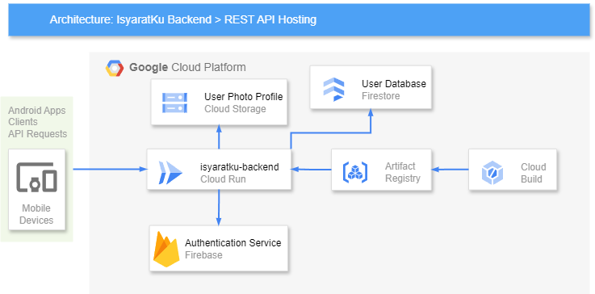

<h1 align="center">
  <br>
    
</h1>

# isyaratku-backend
Welcome to the repository of the IsyaratKu's backend Project. This documentation will guide you through understanding, setting up, developing, and maintaining the IsyaratKu Project. You will receive all the required knowledge and tools from this extensive guide.

## Table of Contents
1. [Introduction](#introduction)
2. [Architecture](#architecture)
3. [Prerequisites](#prerequisites)
4. [Development](#development)
5. [Project Structure](#project-structure)
6. [API Documentation & Deployment-Infrastucture](#api-documentation--deployment-infrastucture)
7. [Cloud Computing Team](#cloud-computing-team)


## Introduction
IsyaratKu is an Android app that uses machine learning to enhance accessibility for learning sign languages. It uses real-time hand gesture recognition and gamification elements to motivate continuous learning.

## Architecture


## Prerequisites
Before you begin, ensure you have the following software installed:

1. [Node.js](https://nodejs.org/en) (version 20.x or higher)
2. [npm](https://www.npmjs.com/) or [yarn](https://yarnpkg.com/)
3. [Git](https://git-scm.com/)

## Development

To develop the IsyaratKu backend APIs, follow these steps:

1. Clone the repository:

    ```bash
    git clone https://github.com/IsyaratKu/isyaratku-backend.git
    ```

2. Navigate to the project directory:

    ```bash
    cd isyaratku-backend
    ```

3. Install the dependencies:

    ```bash
    npm install
    ```

    or

    ```bash
    yarn install
    ```

4. Configure the environment variables:

    - Create a `.env` file in the root directory.
    - Copy the content of `.env.example` into `.env`.
    - Update the values of the environment variables in `.env` as per your configuration.
    
    ```
    # Example Environment Variables
    
    # Firebase Configuration
    FIREBASE_API_KEY=yourapikey
    FIREBASE_AUTH_DOMAIN=yourauthdomain
    FIREBASE_PROJECT_ID=yourprojectid
    FIREBASE_STORAGE_BUCKET=yourstoragebucket
    FIREBASE_MESSAGING_SENDER_ID=yourmessagingsenderid
    FIREBASE_APP_ID=yourappid
    
    # Service Account Configuration
    SERVICE_ACCOUNT_TYPE=yourtype
    SERVICE_ACCOUNT_PROJECT_ID=yourprojectid
    SERVICE_ACCOUNT_PRIVATE_KEY_ID=yourprivatekeyid
    SERVICE_ACCOUNT_PRIVATE_KEY=yourprivatekey
    SERVICE_ACCOUNT_CLIENT_EMAIL=yourclientemail
    SERVICE_ACCOUNT_CLIENT_ID=yourclientid
    SERVICE_ACCOUNT_AUTH_URI=yourauthuri
    SERVICE_ACCOUNT_AUTH_PROVIDER_X509_CERT_URL=yourauthproviderx509certurl
    SERVICE_ACCOUNT_CLIENT_X509_CERT_URL=yourclientx509certurl
    SERVICE_ACCOUNT_UNIVERSE_DOMAIN=youruniversedomain
    ```

    Or simply just do:
    ```bash
    cp .env.example .env
    ```
    then adjust the value with your configuration.

5. Start the server:

    ```bash
    npm run start:dev
    ```

    or
    ```bash
    yarn start:dev
    ```

6. The backend APIs should now be accessible at `http://localhost:5000`.

## Project Structure
Below is an overview of the project's directory layout and a brief explanation of each component.

```
isyaratku-backend/
├── assets/
│   ├── IsyaratKu-architecture.png
│   └── IsyaratKu-logo.png
├── src/
│   ├── config/
│   │   └── firebase.js
│   ├── data/
│   │   ├── asl-sentences.json
│   │   └── bisindo-sentences.json
│   ├── middleware/
│   ├── routes
│   │   └── routes.js
│   └── services
│       ├── auth
│       │   └── auth-service.js
│       └── challenge
│           ├── asl-service.js
|           ├── bisindo-service.js
│           ├── leaderboard-service.js
│           └── save-score-service.js
├── .env
├── .env.example
├── .gitignore
├── Dockerfile
├── index.js
├── package-lock.json
├── package.json
└── README.md
```

### Root Directory
- .env : Contains environment variables used in the project.
- .gitignore : Specifies files and directories to be ignored by Git.
- Dockerfile : Deployment configuration
- index.js : Entry point for starting IsyaratKu Backend application
- package-lock.json : List of project packages dependencies
- package.json : Lists project dependencies and scripts.
- README.md : Provides an overview of the project, setup instructions, and other essential information.
- assets/ : Provides the logo and architecture image for IsyaratKu

### `src/`
Main source directory of the project.
- `config/` : contains the project configuration.
    - `firebase.js`: contains the configuration and initialization for Firebase SDK.
- `data/` : contains the project sentences dataset.
    - `asl-sentences.json` : contains the English sentence dataset for ASL challenge.
    - `bisindo-sentences.json` : contains the Indonesian sentence dataset for Bisindo challenge.
- `middleware/`: Contains middleware functions of verifying token used in the project.
- `routes/`: contains the project routing.
    - `routes.js` : contains the routing logic for the IsyaratKu Backend application.
- `services/` : contains the project service functions.
    - `auth/`: contains the project authentication service.
        - `auth-service.js` : contains the authentication logic and other user logic functions.
    - `challenge/` : contains the project challenge service.
        - `asl-service.js` : contains the ASL challenge service logic.
        - `bisindo-service.js` : contains the Bisindo challenge service logic.
        - `leaderboard-service.js` : contains rank of score of ASL and Bisindo for user.
        - `save-score-service.js` : contains the update of ASL and Bisindo score for user database.

## API Documentation & Deployment-Infrastucture

For detailed information about the available APIs and their uses as well as deployment procedures and infrastructure used, see [IsyaratKu-Backend Wiki](https://github.com/IsyaratKu/isyaratku-backend/wiki).

## Cloud Computing Team
| Name       | Student ID   |
|------------|--------------|
| Danendra Herdiansyah   | C010D4KY0934     |
| Muhammad Azka Obila Vasya | C006D4KY0767     |
